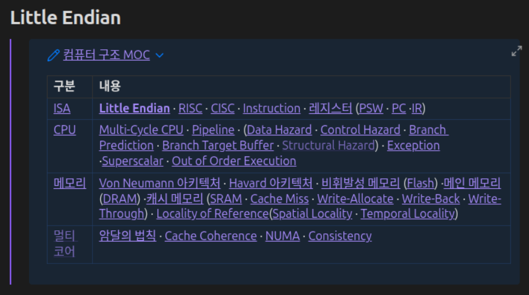

# Self Link Highlighter

An Obsidian plugin that bolds links pointing to the note you are currently
viewing, similar to how MediaWiki renders self-links.

## Why

When a note is embedded with `![[...]]`, the embedded content may contain
links back to the note you are reading. Obsidian renders these as ordinary
links, so there is no visual cue that you are already there. This plugin
renders them in bold, while keeping them clickable.

## Behaviour

| Situation | Result |
| --- | --- |
| `[[A]]` inside A | bold link |
| `[[B]]` inside A | normal link |
| `[[A]]` inside `![[B]]` while viewing A | bold link |

Aliases (`[[A\|label]]`) and heading links (`[[A#section]]`) are recognised
as self-links.

## Usage

### Manual installation

Copy the following files into your vault:

    <VaultFolder>/.obsidian/plugins/self-link-highlighter/
      ├── main.js
      ├── manifest.json
      └── styles.css

Create the `self-link-highlighter` folder if it does not exist.

`.obsidian` is hidden by default, so you may need to enable hidden files in
your file manager (`Cmd+Shift+.` on macOS, View → Hidden items on Windows).

### Enabling

1. Restart Obsidian, or run **Reload app without saving** from the command
   palette.
2. Open **Settings → Community plugins**. If Restricted mode is on, turn it
   off first.
3. Find **Self Link Highlighter** in the installed plugins list and toggle
   it on.

Switch a note to Reading view to see the effect.

### Building from source

    git clone https://github.com/<user>/self-link-highlighter
    cd self-link-highlighter
    npm install
    npm run build

This produces `main.js` in the project root. Copy it along with
`manifest.json` and `styles.css` as described above. During development you
can clone directly into `<VaultFolder>/.obsidian/plugins/` and run
`npm run dev` to rebuild on change.

## Customising

Add a CSS snippet targeting `.is-self-link` to change the appearance:

    .is-self-link {
      color: var(--text-accent);
    }

## Limitations

Reading view only. Live Preview is not supported yet.

Self-links are resolved once, when the content is rendered. If another pane
is focused at that moment, the wrong note may be used as the reference.
Reopening the note fixes it.